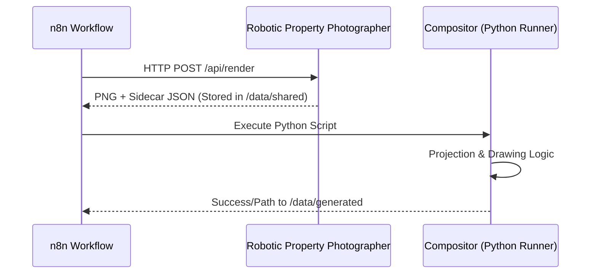

# Property Image Compositor

> **⚠️ CRITICAL ARCHITECTURE REQUIREMENT**: This repository is NOT a standalone application. It is a library of Python scripts designed to be executed by **n8n's external Python runner**.

## Execution Environment Guardrails

1. **Host Environment**: Runs inside an alpine-based Docker container managed by n8n.
2. **Trigger**: Executed via n8n workflows after [Robotic Property Photographer](https://github.com/ditchallaway/Robotic-Property-Photographer) finishes.
3. **No Web Server**: Do NOT implement FastAPI, Flask, or any HTTP listener.
4. **No Database**: All state is ephemeral or passed via JSON payloads/file system.
5. **No Standalone Dockerfile**: The environment is defined by the `runners/Dockerfile` in the main n8n setup.

---

## Overview

Automated Python module that transforms raw 3D renders into deliverable property images.

### Input/Output (n8n Bind Mounts)
- **Input**: Raw PNGs + Sidecar JSON in `/data/shared/`
- **Output**: Final composed images in `/data/generated/`

### Key Features
- **3D Tubular Boundary Overlays** - Yellow stroke with depth effects
- **Perspective Acres Text** - Tilted to match ground plane
- **Billboard Street Labels** - Camera-facing, perpendicular to ground

---

## n8n Integration Flow

---

## Next Steps for AI Assistants

Always refer to [IMPLEMENTATION_PLAN.md](./IMPLEMENTATION_PLAN.md) for the mathematical projection logic and styling requirements.

- [ ] Implement `project.py` using NumPy for matrix operations
- [ ] Implement `draw.py` using Pillow/PyCairo
- [ ] Implement `compose.py` as the entry point for n8n
