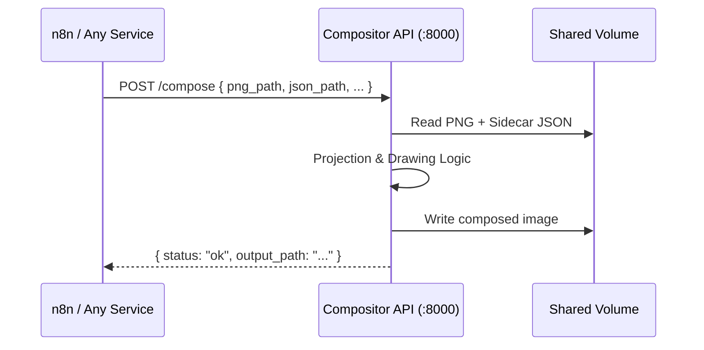

# Property Image Compositor

Standalone Python microservice that transforms raw 3D renders into deliverable property images. Exposes a REST API via **FastAPI** and runs in its own Docker container.

---

## Architecture



The compositor runs as a long-lived container on a shared Docker network (`compositor_net`). Any service on the network can call its API.

---

## API

### `POST /compose`

Compose a property image from a raw render and sidecar JSON.

**Request:**
```json
{
  "png_path": "/data/shared/west.png",
  "json_path": "/data/shared/west.json",
  "output_path": "/data/generated/composed_west.png",
  "output_format": "png",
  "stage": 2
}
```

| Field | Required | Default | Description |
|---|---|---|---|
| `png_path` | ✅ | — | Path to raw input PNG |
| `json_path` | ✅ | — | Path to sidecar JSON with matrices/metadata |
| `output_path` | ✅ | — | Path for the output file |
| `output_format` | ❌ | `"png"` | `"png"`, `"psd"`, or `"both"` |
| `stage` | ❌ | `2` | `1` = lines only, `2` = full composition |

**Response (success):**
```json
{ "status": "ok", "output_path": "/data/generated/composed_west.png" }
```

**Response (error):**
```json
{ "status": "error", "detail": "File not found: /data/shared/west.png" }
```

### `GET /health`

```json
{ "status": "healthy" }
```

---

## Key Features

- **3D Tubular Boundary Overlays** — Yellow stroke with depth effects
- **Perspective Acres Text** — Tilted to match ground plane
- **Billboard Street Labels** — Camera-facing, perpendicular to ground
- **PSD Export** — Layered Photoshop files with hidden reference grid

---

## Quick Start

```bash
docker compose up --build -d

# Health check
curl http://localhost:8000/health

# Compose an image
curl -X POST http://localhost:8000/compose \
  -H "Content-Type: application/json" \
  -d '{"png_path":"/app/test_data/raw/west.png","json_path":"/app/test_data/raw/west.json","output_path":"/app/output/composed_west.png"}'

# Browse output
open http://localhost:8080/output/
```

---

## Project Structure

```
src/
├── api/
│   └── main.py              # FastAPI app + endpoints
└── compositor/
    ├── compose.py            # Main composition pipeline
    ├── boundary.py           # 3D boundary overlay renderer
    ├── labels.py             # Street label + acres text
    ├── project.py            # 3D → 2D matrix projection
    ├── grid.py               # Reference grid layer
    └── psd_export.py         # Layered PSD export
```

---

## Next Steps for AI Assistants

Refer to [IMPLEMENTATION_PLAN.md](./IMPLEMENTATION_PLAN.md) for the mathematical projection logic and styling requirements.

Refer to [Design Doc](./docs/plans/2026-02-15-fastapi-restructure-design.md) for the restructuring rationale and migration notes.
