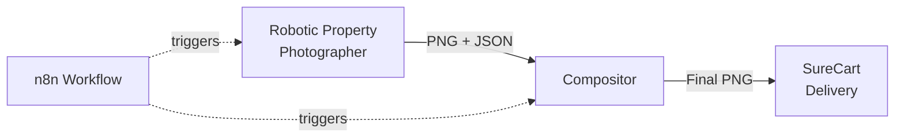

# Property Image Compositor

> Component 2 of **Virtual Drone Photography for Real Estate**

Automated Python service that transforms raw 3D renders into client-deliverable property images by adding styled boundary overlays, perspective acres text, and billboard street labels.

---

## Overview

This compositor consumes outputs from [Robotic Property Photographer](https://github.com/ditchallaway/Robotic-Property-Photographer):
- **Input**: Raw PNG renders + sidecar JSON (3D coordinates, camera matrices, street data)
- **Output**: Final composed images ready for delivery

### Key Features
- **3D Tubular Boundary Overlays** - Yellow stroke with depth effects
- **Perspective Acres Text** - Follows ground plane with full 3D projection
- **Billboard Street Labels** - Camera-facing, perpendicular to ground
- **Configurable Styling** - External config for colors, fonts, shadows

---

## Quick Links

- [Implementation Plan](./IMPLEMENTATION_PLAN.md) - Full technical specification
- [Task Checklist](./TASK.md) - Development progress
- [Examples](./examples/) - Before/after visual references

---

## Architecture

**Deployment**: Runs in n8n's external Python runner environment

---

## Sample Output

See the `examples/` folder for before/after comparisons showing:
- 3D boundary effect style
- Perspective acres text placement
- Billboard street label rendering

---

## Development Status

- [x] Planning & architecture design
- [ ] Core projection implementation
- [ ] Boundary renderer
- [ ] Text placement systems
- [ ] n8n integration
- [ ] Visual verification

See [TASK.md](./TASK.md) for detailed progress.

---

## Technical Stack

- **Python 3.x** with Pillow, NumPy, PyCairo
- **n8n** for workflow orchestration
- **Matrix-based 3D projection** from sidecar JSON

---

## Related Projects

- [Robotic Property Photographer](https://github.com/ditchallaway/Robotic-Property-Photographer) - Upstream renderer (Component 1)

---

## License

MIT
